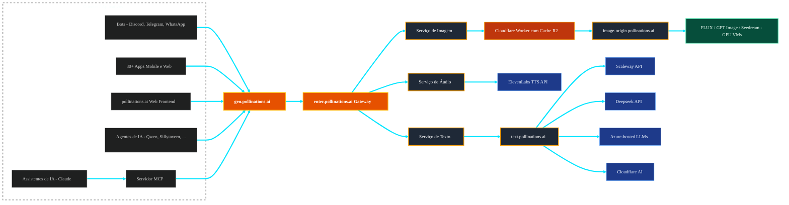

<div align="center">
  <picture>
    <source media="(prefers-color-scheme: dark)" srcset="assets/logo-text-white.svg" />
    
  </picture>
  
  <p><strong>IA open-source para pessoas que criam coisas.</strong> Readme - Traduzido para Português</p>

[](https://github.com/pollinations/pollinations)
[](LICENSE)
[](https://discord.gg/pollinations-ai-885844321461485618)

[Site](https://pollinations.ai) · [Dashboard](https://enter.pollinations.ai) · [Docs da API](APIDOCS.md) · [Discord](https://discord.gg/pollinations-ai-885844321461485618)

</div>

<p align="center"></p>

## 🆕 Aplicativos Recentes

| Nome | Descrição | Autor |
|------|-----------|-------|
| [🎹 AI MIDI GENERATOR](https://midi-aigenerator.vercel.app/) | Gere arquivos MIDI com múltiplas faixas a partir de prompts em linguagem natural no navegador com o AI MIDI GENERATOR, uma ferramenta gratuita para produtores, compositores e desenvolvedores de jogos. | [@web](https://github.com/web) |
| [🎬 Chorvanto](https://chorvanto.randever.com) | Gere videoclipes originais com o Chorvanto, uma plataforma com IA que formata e distribui para múltiplas redes sociais. | [@web](https://github.com/web) |
| [🎬 StoryBoard Ai](https://ai-story-board-flax.vercel.app/) | Gere storyboards cinematográficos cena por cena com o StoryBoard Ai, um aplicativo web open-source que transforma ideias em frames visualizados usando o pollinations.ai para geração de imagens. | [@web](https://github.com/web) |
| [💬 Phicasso Chat](https://chat.phicasso.ai/) | Funciona totalmente no navegador sem necessidade de contas ou armazenamento no servidor; o Phicasso Chat mantém as conversas no dispositivo do usuário e utiliza o Pollinatio. | [@web](https://github.com/web) |
| [🗣️ Pratica um segundo idioma](https://proyectodescartes.org/IATools/131_Practica_el_segundo_idioma/) | Pratique um segundo idioma com exercícios de conversação, vocabulário e compreensão auditiva com acompanhamento de progresso. | [@web](https://github.com/web) |
| [🖼️ LND Ai](https://www.namansoni.in/text-to-image) | Gere saídas de texto para imagem e acesse diversas outras ferramentas de IA no site LND Ai, powered by pollination ai. | [@web](https://github.com/web) |
| [🎨 Pollinations AI All-in-One Generation](https://mokindred.github.io/) | Gere imagens, músicas e textos com o Pollinations AI All-in-One Generation usando prompts personalizáveis, controles de estilo e opções de formato de saída. | [@web](https://github.com/web) |
| [🖼️ Webcalypt Image Generator](https://img-webcalypt.ru/tools/text-to-img) | Gere imagens com IA a partir de prompts em linguagem natural usando o Webcalypt Image Generator. Descreva a cena, estilo ou humor e a ferramenta cria uma imagem correspondente. | [@web](https://github.com/web) |
| [⚛️ Physics study with AI](https://physicsatlas.github.io/PhysicsAtlas/) | Pratique problemas de física e receba soluções e explicações passo a passo com o Physics study with AI. | [@web](https://github.com/web) |
| [📝 JournalGen](https://www.ai-ministries.com/apps/journalgen/) | Renderiza a imagem em srchttpsgithub.comuser-attachmentsassets4c598841-49e5-450e-8d13-f4defcdd7902 para o JournalGen. | [@web](https://github.com/web) |

[Ver todos os aplicativos →](apps/GREENHOUSE.md)

## 🚀 Nova API Unificada — Já Disponível

Lançamos **https://gen.pollinations.ai** — um único endpoint para todas as suas necessidades de geração de IA: texto, imagens, áudio, vídeo — tudo em um só lugar.

### O Que Há de Novo

- **Endpoint unificado** — API única em `gen.pollinations.ai` para toda geração
- **Créditos Pólen** — sistema simples de pagamento por uso ($1 ≈ 1 Pólen)
- **Todos os modelos, em um lugar** — Flux, GPT-5, Claude, Gemini, Seedream e mais
- **Chaves de API** — chaves publicáveis para frontend, chaves secretas para backend

> Comece em [enter.pollinations.ai](https://enter.pollinations.ai) e confira a [documentação da API](https://enter.pollinations.ai/api/docs)

## 🆕 Últimas Notícias

- **2026-03-22** – **🤖 Modelos Qwen & Visão** Os modelos Qwen da Alibaba (`qwen-coder-large`, `qwen-large` e `qwen-vision`) já estão disponíveis na [API Unificada](https://gen.pollinations.ai). Janelas de contexto de 1M e compreensão de imagens, completamente desbloqueados para o plano gratuito.
- **2026-03-22** – **🎨 Showcase LND Ai** O LND Ai foi adicionado ao showcase da comunidade. Mais uma sólida ferramenta de texto para imagem construída inteiramente usando nossa [API](https://enter.pollinations.ai/api/docs).
- **2026-03-20** – **🎨 Mesclagem Multi-Imagem Klein** O pipeline de imagem para imagem do modelo Klein agora aceita até quatro imagens de referência paralelas via endpoint multipart. Confira a [Documentação da API](https://enter.pollinations.ai/api/docs) para começar a mesclar.
- **2026-03-20** – **💻 Integrações PowerShell & .NET** Agora você pode direcionar a geração de texto e imagens diretamente para seus scripts Windows e fluxos de trabalho Azure. Porque às vezes você só precisa gerar pixels a partir de um terminal.
- **2026-03-20** – **🌟 Explosão de Showcases** O diretório da comunidade está crescendo. As novas adições incluem um gerador diário de criaturas místicas, um bot de análise financeira turco, um exportador de histórias em markdown e um designer de buquês com IA. Veja o que as pessoas estão criando no [site principal](https://hello.pollinations.ai).
- **2026-03-19** – **🔗 Integração OpenClaw** Configurar o OpenClaw com o Pollinations agora é mais rápido e menos propenso a erros de configuração graças ao onboarding nativo via CLI para v2026.3.
- **2026-03-18** – **🤖 Silício encontra pólen** Alguém conectou a API a um microcontrolador ESP32-S3 (NEURGenerator). Hackers de hardware agora têm uma referência para levar a geração para dispositivos físicos.
- **2026-03-18** – **📱 Infraestrutura no bolso** O Nova.ai acabou de entrar no showcase — um assistente iOS completo com chat em streaming e geração de imagens construído inteiramente em nossos endpoints.
- **2026-03-18** – **📚 A colmeia escreve um romance** O NovelSeek-Pro-PC agora está no diretório criativo. É uma ferramenta desktop que leva você de uma página em branco a um ebook completamente formatado com arte de capa gerada por IA.
- **2026-03-18** – **👾 Enxame de bots** O showcase da comunidade em nosso [site](https://hello.pollinations.ai) absorveu mais de uma dúzia de novos aplicativos esta semana, incluindo roteadores de modelo para Telegram e presets massivos de bots para Discord.

---

## 🌱 Introdução

[pollinations.ai](https://pollinations.ai) é uma plataforma de IA generativa open-source baseada em Berlim, que alimenta mais de 500 projetos da comunidade com APIs acessíveis de geração de texto, imagem, vídeo e áudio. Construímos de forma aberta e mantemos a IA acessível a todos — graças aos nossos incríveis apoiadores.

## 🚀 Recursos Principais

- 🔓 **100% Open Source** — código, decisões e roadmap todos públicos
- 🤝 **Construído pela Comunidade** — mais de 500 projetos já usando nossas APIs
- 🌱 **Níveis de Pólen** — ganhe créditos contribuindo (níveis em beta)
- 🖼️ **Geração de Imagens** — Flux, GPT Image, Seedream, Kontext
- 🎬 **Geração de Vídeo** — Seedance, Veo (alpha)
- 🎵 **Áudio** — Texto para fala e fala para texto
- 🎣 **_Pacotes Fáceis de Usar_** ([Pacotes](packages/))

<a href="https://star-history.com/#pollinations/pollinations&Date">
 <picture>
   <source media="(prefers-color-scheme: dark)" srcset="https://api.star-history.com/svg?repos=pollinations/pollinations&type=Date&theme=dark" width="600" />
   <source media="(prefers-color-scheme: light)" srcset="https://api.star-history.com/svg?repos=pollinations/pollinations&type=Date" width="600" />
   
 </picture>
</a>

### Início Rápido (3 Etapas)

1️⃣ **Obtenha sua chave de API**  
Cadastre-se em [enter.pollinations.ai](https://enter.pollinations.ai) para gerar sua chave.

2️⃣ **Escolha o que deseja gerar**  
Pollinations suporta:
- 🖼 Imagens  
- 📝 Texto  
- 🔊 Áudio  
- 🎬 Vídeo  

3️⃣ **Faça sua primeira requisição**  
Use um dos exemplos abaixo para gerar sua primeira saída de IA em segundos.


## 🚀 Primeiros Passos

[](https://deepwiki.com/pollinations/pollinations)

### Geração de Imagens

```bash
curl 'https://gen.pollinations.ai/image/a%20beautiful%20sunset' -o image.jpg
```

Ou visite [pollinations.ai](https://pollinations.ai) para uma experiência interativa.

### Geração de Texto

```bash
curl 'https://gen.pollinations.ai/text/Hello%20world'
```

### Geração de Áudio

**Endpoint GET simples:**

```bash
curl 'https://gen.pollinations.ai/audio/Hello%20from%20Pollinations?voice=nova&key=YOUR_API_KEY' -o speech.mp3
```

**Compatível com OpenAI TTS:**

```bash
curl 'https://gen.pollinations.ai/v1/audio/speech' \\
  -H 'Content-Type: application/json' \\
  -H 'Authorization: Bearer YOUR_API_KEY' \\
  -d '{"model": "tts-1", "input": "Hello from Pollinations!", "voice": "nova"}' \\
  -o speech.mp3
```

Vozes disponíveis: `alloy`, `echo`, `fable`, `onyx`, `nova`, `shimmer`, mais [30+ vozes ElevenLabs](https://enter.pollinations.ai/api/docs).

### Servidor MCP para Assistentes de IA

Nosso servidor MCP (Model Context Protocol) permite que assistentes de IA como o Claude gerem imagens e áudio diretamente. [Saiba mais](./packages/mcp/README.md)

#### Configuração

Adicione isto à configuração do seu cliente MCP:

```json
{
  "mcpServers": {
    "pollinations": {
      "command": "npx",
      "args": ["@pollinations_ai/mcp"]
    }
  }
}
```

### Execute com npx (sem instalação necessária)

```bash
npx @pollinations_ai/mcp
```

Alternativas da comunidade como [MCPollinations](https://github.com/pinkpixel-dev/MCPollinations) e [Sequa MCP Server](https://mcp.sequa.ai/v1/pollinations/contribute) também estão disponíveis.

Assistentes de IA podem:

- Gerar imagens a partir de descrições de texto
- Criar áudio de texto para fala com várias opções de voz
- Reproduzir respostas de áudio pelos alto-falantes do sistema
- Acessar todos os modelos e serviços do pollinations.ai
- Listar modelos, vozes e capacidades disponíveis

Para uso mais avançado, confira nossa [documentação da API](APIDOCS.md).

## 🔐 Autenticação

Obtenha sua chave de API em [enter.pollinations.ai](https://enter.pollinations.ai)

### Tipos de Chave

| Chave           | Prefixo | Caso de Uso                              | Limites de Requisição      | Status  |
| --------------- | ------- | ---------------------------------------- | -------------------------- | ------- |
| **Publicável**  | `pk_`   | Lado do cliente, demos, protótipos       | 1 pólen por IP por hora    | ⚠️ Beta |
| **Secreta**     | `sk_`   | Somente lado do servidor                 | Sem limites de requisição  | Estável |

> ⚠️ **Chaves publicáveis:** Proteção Turnstile em breve. Não recomendado para produção ainda.

> ⚠️ **Nunca exponha chaves `sk_`** em código do lado do cliente, repositórios git ou URLs públicas

> 💡 **Construindo um aplicativo?** Use o [Bring Your Own Pollen](./BRING_YOUR_OWN_POLLEN.md) — os usuários pagam pelo próprio uso, você paga $0

### Restrições de Modelo

Cada chave de API pode ser limitada a modelos específicos. Ao criar uma chave em [enter.pollinations.ai](https://enter.pollinations.ai), você pode:

- **Permitir todos os modelos** — a chave funciona com qualquer modelo disponível
- **Restringir a modelos específicos** — selecione exatamente quais modelos a chave pode acessar (por exemplo, apenas `flux` e `openai`, ou somente `gptimage-large`)

### Uso

```bash
curl 'https://gen.pollinations.ai/image/a%20cat?key=YOUR_KEY'
```

**Variável de ambiente (melhor prática):**

```bash
export POLLINATIONS_API_KEY=sk_...
```

Consulte a [documentação completa da API](APIDOCS.md) para informações detalhadas de autenticação.

## 🖥️ Como Usar

### Interface Web

Nossa interface web é fácil de usar e não requer nenhum conhecimento técnico. Simplesmente visite [https://pollinations.ai](https://pollinations.ai) e comece a criar!

### API

Use nossa API diretamente no seu navegador ou aplicações:

    [https://pollinations.ai/p/a_cozy_pixel_art_robot_and_bee_in_a_digital_garden_8-bit_warm_stardew_valley_vibes](https://pollinations.ai/p/a_cozy_pixel_art_robot_and_bee_in_a_digital_garden_8-bit_warm_stardew_valley_vibes)

Substitua a descrição pela sua e você obterá uma imagem única baseada em suas palavras!

Aqui está um exemplo de imagem gerada:

<p align="center"></p>

<p align="center"></p>

## 🎨 Exemplos

### Geração de Imagens

Código Python para baixar a imagem gerada:

    import requests

    def download_image(prompt):
        url = f"https://pollinations.ai/p/{prompt}"
        response = requests.get(url)
        with open('generated_image.jpg', 'wb') as file:
            file.write(response.content)
        print('Imagem baixada!')

    download_image("a_cozy_pixel_art_robot_and_bee_in_a_digital_garden_8-bit_warm_stardew_valley_vibes")

### Geração de Texto

Para gerar texto:

    [https://gen.pollinations.ai/text/What%20is%20artificial%20intelligence?](https://gen.pollinations.ai/text/What%20is%20artificial%20intelligence?)

### Geração de Áudio

Gere fala a partir de texto:

    [https://gen.pollinations.ai/audio/Hello%20from%20Pollinations?voice=alloy&key=YOUR_API_KEY](https://gen.pollinations.ai/audio/Hello%20from%20Pollinations?voice=alloy&key=YOUR_API_KEY)

Ou use o endpoint compatível com OpenAI TTS:

```bash
curl 'https://gen.pollinations.ai/v1/audio/speech' \\
  -H 'Content-Type: application/json' \\
  -H 'Authorization: Bearer YOUR_API_KEY' \\
  -d '{"model": "tts-1", "input": "Hello from Pollinations!", "voice": "alloy"}' \\
  -o speech.mp3
```

## 🛠️ Integração

### SDK

Confira nosso [Pollinations SDK](./packages/sdk/README.md) para integração com Node.js, navegador e React.

## Arquitetura



## 🔮 Desenvolvimentos Futuros

Estamos constantemente explorando novas formas de expandir os limites da criação de conteúdo com IA. Algumas áreas que nos entusiasmam incluem:

- Gêmeos Digitais: Criação de avatares interativos impulsionados por IA
- Geração de Videoclipes: Combinação de visuais gerados por IA com música para experiências de vídeo únicas
- Experiências Visuais em Tempo Real com IA: Projetos como nossa Dreamachine, que criam jornadas visuais imersivas e personalizadas

## 🌍 Nossa Visão

pollinations.ai imagina um futuro onde a tecnologia de IA é:

- **Aberta e Acessível**: Acreditamos que a IA deve estar disponível para todos — ganhe Pólen contribuindo, sem necessidade de cartão de crédito

- **Transparente e Ética**: Nossa abordagem open-source garante transparência em como nossos modelos funcionam e se comportam

- **Orientada pela Comunidade**: Estamos construindo uma plataforma onde desenvolvedores, criadores e entusiastas de IA podem colaborar e inovar

- **Interconectada**: Estamos criando um ecossistema onde os serviços de IA podem trabalhar juntos perfeitamente, fomentando a inovação por meio da composabilidade

- **Em Evolução**: Abraçamos a rápida evolução da tecnologia de IA mantendo nosso compromisso com abertura e acessibilidade

Estamos comprometidos em desenvolver tecnologia de IA que sirva à humanidade, respeitando limites éticos e promovendo inovação responsável. Junte-se a nós para moldar o futuro da IA.

## 🤝 Comunidade e Desenvolvimento

Acreditamos no desenvolvimento orientado pela comunidade. Você pode contribuir para o pollinations.ai de várias formas:

1. **Assistente de Código**: A forma mais fácil de contribuir! Basta [criar uma issue no GitHub](https://github.com/pollinations/pollinations/issues/new) descrevendo o recurso que você gostaria de ver implementado. O [assistente de IA MentatBot](https://mentat.ai/) irá analisar e implementar diretamente! Não é necessário saber programar — apenas descreva o que deseja.

2. **Submissão de Projetos**: Você construiu algo com o pollinations.ai? [Use nosso template de submissão de projetos](https://github.com/pollinations/pollinations/issues/new?template=project-submission.yml) (rotulado como **APPS**) para compartilhar com a comunidade e ter destaque em nosso README.

3. **Solicitações de Recursos e Relatórios de Bugs**: Tem uma ideia ou encontrou um bug? [Abra uma issue](https://github.com/pollinations/pollinations/issues/new) e nos avise. Nossa equipe e o assistente MentatBot irão revisá-la.

4. **Engajamento na Comunidade**: Junte-se à nossa vibrante [comunidade no Discord](https://discord.gg/pollinations-ai-885844321461485618) para:
   - Compartilhar suas criações
   - Obter suporte e ajudar outros
   - Colaborar com outros entusiastas de IA
   - Discutir ideias de recursos antes de criar issues

Para quaisquer dúvidas ou suporte, visite nosso [canal do Discord](https://discord.gg/pollinations-ai-885844321461485618) ou crie uma issue em nosso [repositório GitHub](https://github.com/pollinations/pollinations).

## 🗂️ Estrutura do Projeto

Nossa base de código está organizada em várias pastas principais, cada uma com um propósito específico no ecossistema pollinations.ai:

- [`pollinations.ai/`](./app/): O aplicativo React principal para o site do Pollinations.ai.

- [`image.pollinations.ai/`](./image.pollinations.ai/): Serviço backend para geração e cache de imagens com Cloudflare Workers e armazenamento R2.

- [`text.pollinations.ai/`](./text.pollinations.ai/): Serviço backend para geração de texto.

- [`packages/sdk/`](./packages/sdk/): Biblioteca NPM SDK com funções prontas do pollinations para o Pollinations.ai.

- [`packages/ompc/`](./packages/ompc/): Oh My Polli Code é um mecanismo de roteamento de código aberto pronto, construído sobre o framework de código aberto mas com os modelos do pollinations.

- [`packages/mcp/`](./packages/mcp/): Servidor Model Context Protocol (MCP) para assistentes de IA como o Claude gerarem imagens diretamente.

Esta estrutura abrange o site frontend, serviços backend para geração de imagens e texto, e integrações como o bot do Discord e o servidor MCP, fornecendo um framework abrangente para a plataforma pollinations.ai.

Para configuração de desenvolvimento e gerenciamento de ambiente, consulte [DEVELOP.md](./DEVELOP.md).

## 🏢 Apoiado Por

> pollinations.ai tem o orgulho de ser apoiado por:

<p align="center"></p>

- [Perplexity AI](https://www.perplexity.ai/): Motor de busca e respostas conversacionais com IA
- [AWS Activate](https://aws.amazon.com/): Créditos de GPU na
